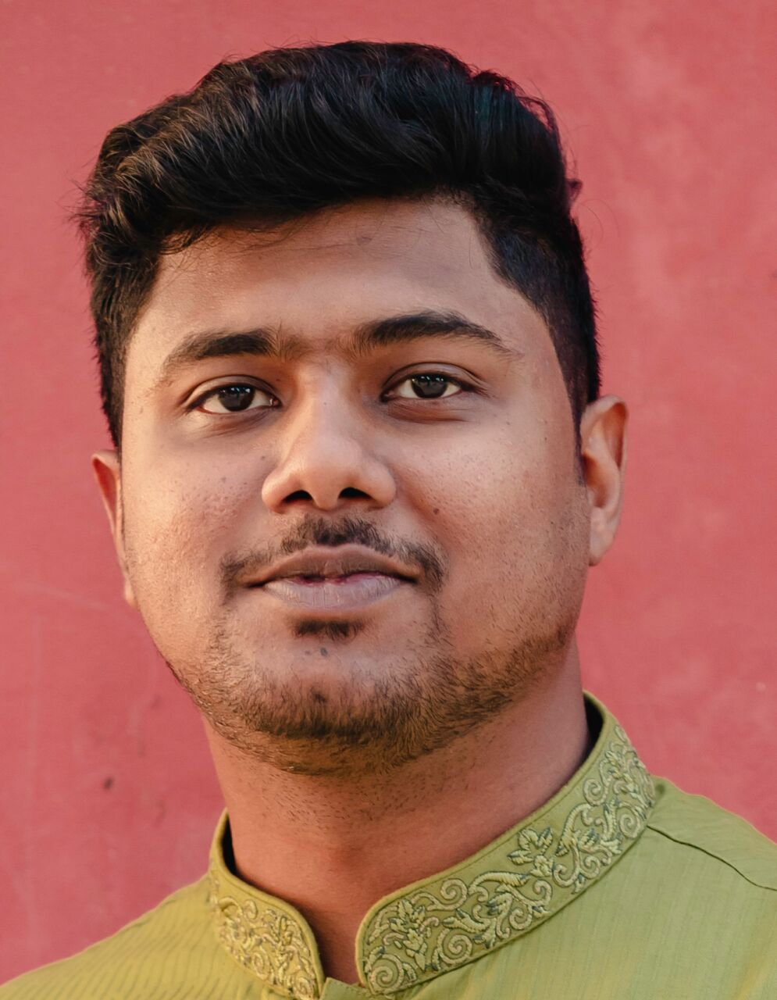

# Mithun Waddadar

📍 **BWDB | Magura | Bangladesh**  
📞 +880183-9682726  
📧 mwshawn7@gmail.com  
[🔗 LinkedIn](https://www.linkedin.com/in/mithun-waddadar)

---

## 👨‍💻 About Me

I’m a Sub-Divisional Engineer at Bangladesh Water Development Board, currently posted in Magura. Over the years, I’ve had the opportunity to work across diverse regions—starting at the Planning Office in Dhaka, then gaining hands-on field experience in coastal Cox’s Bazar, and now continuing my journey in the heart of southwestern Bangladesh.

Though my academic background is in Environmental Engineering from BUET—where I focused on anaerobic wastewater treatment for my thesis—I’ve since transitioned into the field of Water Resources Engineering. My professional interests lie in riverbank erosion, channel shifting, and sediment transport—areas I plan to explore further through future research and publication.

Beyond engineering design and project implementation, I have a strong inclination toward data-driven decision-making. I work regularly with tools like Microsoft Excel, Python, and ArcGIS for spatial and statistical analysis. I’m also experienced in public procurement and contract management within government infrastructure projects.

With each project and region I serve, I aim to contribute to sustainable water management solutions tailored to the unique challenges of Bangladesh.

---

## 🏗 Work Experience

- **Sub Divisional Engineer**, Magura WD Sub Division-2, BWDB, Magura. September 2024 - Present
- **Sub Divisional Engineer**, Cox's Bazar O&M Sub Division, BWDB, Cox's Bazar. February, 2023 - September 2024
- **Assistant Engineer**, Cox's Bazar O&M Division, BWDB, Cox's Bazar. February, 2021 - February, 2023 
- **Assistant Engineer**, Office of Chief Engineer (Planning), BWDB, Dhaka. July, 2019 - February, 2021

---

## 💡 Training 

- **Introduction of Hydrological Model using HEC-HEC** under Project for Planning Capacity Enhancement and Establishment of A Technology Adaptation Cycle on Comprehensive Nodi (River) Management by JICA Expert Team
- **Programming for Everybody (Getting Started with Python)** an online non-credit course authorized by University of Michigan and offered through Coursera.
- **Introduction to Data Analysis using Microsoft Excel** an online non-credit project authorized by Coursera Project Network and offered through Coursera.
- **Basic Procurement Training under Digitizing Implementation Monitoring and Public Procurement Project** organized by CPTU, IMED, Ministry of Planning
- **Foundation Training Course** under Training Institute, BWDB.
- **Design of Small Scale Hydraulic Structure and River Training Works** under Training Institute, BWDB.

---

## 🏗️ Work Interests

- Bank Erosion
- Bankline Shifting
- Sediment Transportation
- Flood management
- Sustainable Water Resources Management

---

## 💼 Skills

- **Programming Language:** Python, Visual Basic, C, C++
- **Software:** ArcGIS, Microsoft Office, AutoCAD, HEC-RAS, VSCode, SAP, ETABS, MATLAB, Adobe Premier Pro
- **Website:**  [E-procurement](https://www.eprocure.gov.bd/)

---

## 🎓 Education

- **B.Sc. in Civil Engineering**, BUET, 2014–2018 — CGPA: 3.72 / 4.00  
- **HSC**, CUET School and College, 2011–2013 — GPA: 5.00  
- **SSC**, CUET School and College, 2006–2011 — GPA: 5.00

---

## 🧪 Research Experience

**Performance Evaluation of Lab Scale Hybrid Up-flow Anaerobic Sludge Blanket Reactor in Treating Textile Wastewater** under Department of Civil Engineering in the Faculty of Civil Engineering, Bangladesh University of Engineering and Technology (BUET), Dhaka. My thesis supervisor was [Dr. Tanvir Ahmed](https://ce.buet.ac.bd/profile-of-tanvir-ahmed/)

---

## 📃 Publications
1. Conference Paper titled: [PROSPECTS OF HYBRID UP-FLOW ANAEROBIC SLUDGE BLANKET REACTOR IN TREATING TEXTILE WASTEWATER IN BANGLADESH](https://www.researchgate.net/publication/343007552_PROSPECTS_OF_HYBRID_UP-FLOW_ANAEROBIC_SLUDGE_BLANKET_REACTOR_IN_TREATING_TEXTILE_WASTEWATER_IN_BANGLADESH)

2. Article titled: [Textile wastewater treatment by anaerobic sludge blanket reactor](https://www.researchgate.net/publication/344395778_Textile_wastewater_treatment_by_anaerobic_sludge_blanket_reactor)

---

## 🌟 Leadership

- **Organizer**, Earthquake Competition, Eccentric Civil Fest 2018  
- **General Secretary**, BADHAN (Blood Donation Org), Suhrawardy Hall Unit  
- **Survey Team Leader**, CE-104, Jhilmil Project Survey

---

## 🏅 Honours & Awards

- **Champion**, Creative Canvas (Environment), BUET 2018  - A Poster Presentation Featuring our research work.
- **BUET Merit Scholarship** (2016–2018)  
- **BUET Technical Scholarship** (2014–2018)  
- **Agrani Bank Scholarship**

---

## 🎯 Extracurriculars

- **Champion**, Inter Hall Volleyball, 2018 
- **Volunteer**, Civil Summit 2016, BUET  
- **Cycling** — 650+ KM from Banglabandha to Meherpur  
- **Mess Manager**, Suhrawardy Hall, BUET, 2017

---

## 🌐 Languages

- **Bangla** (Native)  
- **English** (Fluent)

---

## 🎨 Interests

Travelling, Cycling, Badminton, Cricket, Football, Volleyball, Literature, Music, Movies

---

## 📌 Contact Info

- **Permanent Address**: Village: East Shakpura, Boalkhali, Chattogram  
- **Present Address**: Magura WD Sub Division-2, BWDB, Magura.  
- **Date of Birth**: 26 August 1996  
- **Nationality**: Bangladeshi

---

## 🧑‍🏫 Reference

- **[Dr. Tanvir Ahmed](https://ce.buet.ac.bd/profile-of-tanvir-ahmed/)**
- **[Dr. Tanjir Saif Ahmed](https://scholar.google.com/citations?user=I0psaXEAAAAJ&hl=en)**
- **[Dr. Robin Kumar Biswas](https://scholar.google.com/citations?user=kt0nSX8AAAAJ&hl=en)**

---

## 📹 Video Creations

- The following Youtube Videos are edited by me.
- **[🔗 Goillachori Khal Excavation](https://youtu.be/__-n3HQEcR0?si=umwnskN53c0aPKT8)**
- **[🔗 Golarpara Khal Excavation](https://youtu.be/02VMBH0vZz4?si=O9zVsHtBcgsfjKk4)**
- **[🔗 Bagguzra Rubber Dam](https://youtu.be/TuO_oG9q-1s?si=DryuZst2BS3m_c2u)**
- **[🔗 Bangladesh Myanmar Border Project](https://youtu.be/M53KZx1t7hI?si=AMcFgBHr0rNu-9Gt)**

